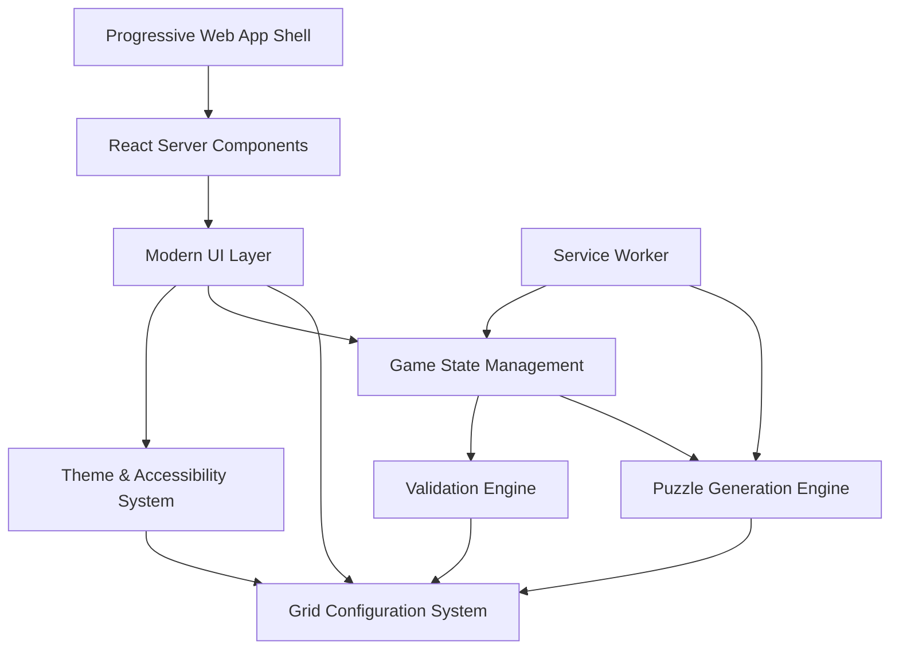

# Design Document: Multi-Size Sudoku for Children

## Overview

This design extends the existing Sudoku Challenge application to support 4×4, 6×6, and 9×9 grid sizes with a focus on child-friendly user experience, WCAG AAA accessibility compliance, and cutting-edge web technologies. The architecture leverages Next.js 16, React 19, and modern web APIs to deliver optimal performance on all devices, especially mobile.

The design emphasizes educational value, visual appeal for children, inclusive accessibility, and modern mobile-first development practices to ensure all young learners can enjoy and benefit from the Sudoku learning experience across any device.

## Modern Technology Stack

### Core Technologies

- **Next.js 16**: Latest App Router with React Server Components and Turbopack
- **React 19**: React Compiler for automatic optimization and concurrent features
- **TypeScript 5.9+**: Strict mode with latest language features
- **pnpm 10.19.0+**: Latest package manager with improved performance

### Modern Web APIs

- **CSS Container Queries**: Responsive design based on component size
- **View Transitions API**: Smooth animations between grid size changes
- **Service Workers**: Offline support and background puzzle generation
- **Web Components**: Reusable child-friendly UI elements
- **Progressive Web App**: App-like experience with installation and notifications

### Performance Optimizations

- **React Compiler**: Automatic memoization and optimization
- **Turbopack**: Ultra-fast bundling for development
- **Code Splitting**: Lazy loading for optimal bundle sizes
- **Core Web Vitals**: Performance monitoring and optimization

## Architecture

### High-Level Architecture



### Modern Architecture Principles

1. **Server-First Rendering**: React Server Components for optimal performance
2. **Progressive Enhancement**: Works without JavaScript, enhanced with it
3. **Mobile-First Design**: Touch-optimized with haptic feedback
4. **Offline-First**: Service Worker for puzzle generation and state persistence
5. **Component-Driven**: Web Components for reusable child-friendly elements
6. **Performance-Optimized**: React Compiler and modern bundling
7. **Backward Compatibility**: Existing 9×9 functionality remains unchanged
8. **Performance Optimization**: Efficient rendering for different grid sizes

## Components and Interfaces

### 1. Grid Configuration System

```typescript
interface GridConfig {
  readonly size: 4 | 6 | 9;
  readonly boxRows: number;
  readonly boxCols: number;
  readonly maxValue: number;
  readonly minClues: number;
  readonly maxClues: number;
  readonly difficultyLevels: number;
  readonly cellSize: {
    desktop: number;
    tablet: number;
    mobile: number;
  };
  readonly childFriendly: {
    enableAnimations: boolean;
    showHelpText: boolean;
    useExtraLargeTargets: boolean;
  };
}

interface GridConfigManager {
  getConfig(size: 4 | 6 | 9): GridConfig;
  validateMove(
    config: GridConfig,
    grid: number[][],
    row: number,
    col: number,
    value: number
  ): boolean;
  calculateDimensions(
    config: GridConfig,
    screenSize: ScreenSize
  ): GridDimensions;
}
```

### 2. Enhanced Game State Management

```typescript
interface MultiSizeGameState extends GameState {
  gridConfig: GridConfig;
  childMode: {
    hintsUsed: number;
    encouragementLevel: 'low' | 'medium' | 'high';
    celebrationStyle: 'minimal' | 'standard' | 'festive';
    soundEnabled: boolean;
  };
  accessibility: {
    highContrast: boolean;
    reducedMotion: boolean;
    fontSize: 'normal' | 'large' | 'extra-large';
    screenReaderMode: boolean;
  };
  progress: {
    [key in 4 | 6 | 9]: {
      puzzlesCompleted: number;
      averageTime: number;
      currentStreak: number;
      achievements: string[];
    };
  };
}

interface MultiSizeGameActions extends GameAction {
  | { type: 'CHANGE_GRID_SIZE'; payload: { size: 4 | 6 | 9 } }
  | { type: 'TOGGLE_CHILD_MODE'; payload: boolean }
  | { type: 'UPDATE_ACCESSIBILITY'; payload: Partial<AccessibilitySettings> }
  | { type: 'CELEBRATE_COMPLETION'; payload: { style: 'confetti' | 'stars' | 'rainbow' } }
  | { type: 'SHOW_ENCOURAGEMENT'; payload: string }
}
```

### 3. Adaptive Puzzle Generation Engine

```typescript
interface MultiSizePuzzleGenerator {
  generatePuzzle(config: GridConfig, difficulty: number): SudokuPuzzle;
  validateUniqueSolution(puzzle: number[][], config: GridConfig): boolean;
  adjustDifficultyForChildren(
    baseDifficulty: number,
    gridSize: 4 | 6 | 9
  ): number;
}

class AdaptivePuzzleGenerator implements MultiSizePuzzleGenerator {
  private generateCompleteBoard(config: GridConfig): number[][];
  private removeNumbersStrategically(
    board: number[][],
    config: GridConfig,
    targetClues: number
  ): number[][];
  private ensureChildFriendlyPatterns(
    puzzle: number[][],
    config: GridConfig
  ): number[][];
}
```

### 4. Modern Mobile-First UI Components

```typescript
// Modern Web Component with React 19 features
interface ModernSudokuGridProps {
  config: GridConfig;
  puzzle: number[][];
  userInput: number[][];
  onInputChange: (row: number, col: number, value: number) => void;
  childMode: boolean;
  accessibilitySettings: AccessibilitySettings;
  theme: ThemeConfig;
  // Modern mobile features
  hapticFeedback: boolean;
  touchGestures: {
    swipeNavigation: boolean;
    pinchZoom: boolean;
    longPressHints: boolean;
  };
  // Performance optimizations
  virtualScrolling?: boolean;
  lazyRendering?: boolean;
}

// Progressive Web App features
interface PWAGridSelectorProps {
  currentSize: 4 | 6 | 9;
  onSizeChange: (size: 4 | 6 | 9) => void;
  childMode: boolean;
  showDescriptions: boolean;
  // PWA features
  offlineMode: boolean;
  installPrompt?: () => void;
  notificationPermission: NotificationPermission;
}

// Modern responsive design with Container Queries
interface ResponsiveContainerProps {
  children: React.ReactNode;
  gridSize: 4 | 6 | 9;
  // Modern CSS features
  containerQueries: boolean;
  viewTransitions: boolean;
  modernViewportUnits: boolean; // dvh, svh, lvh
}

// Touch-optimized controls with haptic feedback
interface TouchOptimizedControlsProps {
  onHint: () => void;
  onCelebrate: () => void;
  onEncourage: () => void;
  hintsRemaining: number;
  showMagicWand: boolean;
  // Modern touch features
  hapticFeedback: {
    success: () => void;
    error: () => void;
    hint: () => void;
  };
  gestureHandlers: {
    onSwipe: (direction: 'up' | 'down' | 'left' | 'right') => void;
    onLongPress: () => void;
    onPinch: (scale: number) => void;
  };
}
```

### 5. Theme and Accessibility System

```typescript
interface ThemeConfig {
  name: string;
  colors: {
    primary: string;
    secondary: string;
    background: string;
    cellBackground: string;
    cellBorder: string;
    errorColor: string;
    successColor: string;
    hintColor: string;
  };
  accessibility: {
    contrastRatio: number;
    focusIndicatorWidth: number;
    minimumTouchTarget: number;
  };
  childFriendly: {
    roundedCorners: number;
    shadowIntensity: number;
    animationDuration: number;
  };
}

interface AccessibilityManager {
  validateThemeCompliance(theme: ThemeConfig): boolean;
  generateHighContrastVariant(theme: ThemeConfig): ThemeConfig;
  calculateOptimalFontSize(gridSize: number, screenSize: ScreenSize): number;
}
```

## Data Models

### Grid Configuration Definitions

```typescript
const GRID_CONFIGS: Record<4 | 6 | 9, GridConfig> = {
  4: {
    size: 4,
    boxRows: 2,
    boxCols: 2,
    maxValue: 4,
    minClues: 8,
    maxClues: 12,
    difficultyLevels: 5,
    cellSize: { desktop: 80, tablet: 70, mobile: 60 },
    childFriendly: {
      enableAnimations: true,
      showHelpText: true,
      useExtraLargeTargets: true,
    },
  },
  6: {
    size: 6,
    boxRows: 2,
    boxCols: 3,
    maxValue: 6,
    minClues: 18,
    maxClues: 28,
    difficultyLevels: 7,
    cellSize: { desktop: 65, tablet: 55, mobile: 45 },
    childFriendly: {
      enableAnimations: true,
      showHelpText: true,
      useExtraLargeTargets: true,
    },
  },
  9: {
    size: 9,
    boxRows: 3,
    boxCols: 3,
    maxValue: 9,
    minClues: 22,
    maxClues: 61,
    difficultyLevels: 10,
    cellSize: { desktop: 45, tablet: 40, mobile: 35 },
    childFriendly: {
      enableAnimations: false,
      showHelpText: false,
      useExtraLargeTargets: false,
    },
  },
};
```

### Child-Friendly Themes

```typescript
const CHILD_THEMES: ThemeConfig[] = [
  {
    name: 'Ocean Adventure',
    colors: {
      primary: '#0077BE', // Ocean blue (7:1 contrast)
      secondary: '#FF6B35', // Coral orange (7:1 contrast)
      background: '#F0F8FF', // Alice blue
      cellBackground: '#FFFFFF',
      cellBorder: '#4A90E2',
      errorColor: '#FF8C42', // Warm orange instead of red
      successColor: '#32CD32', // Lime green
      hintColor: '#FFD700', // Gold
    },
    accessibility: {
      contrastRatio: 7.0,
      focusIndicatorWidth: 3,
      minimumTouchTarget: 50,
    },
    childFriendly: {
      roundedCorners: 12,
      shadowIntensity: 0.2,
      animationDuration: 300,
    },
  },
  // Additional themes: Forest, Space, Rainbow
];
```

## Correctness Properties

_A property is a characteristic or behavior that should hold true across all valid executions of a system—essentially, a formal statement about what the system should do. Properties serve as the bridge between human-readable specifications and machine-verifiable correctness guarantees._

<function_calls>
<invoke name="prework">
<parameter name="featureName">multi-size-sudoku

### Property Reflection

After analyzing all acceptance criteria, I identified several areas where properties can be consolidated to eliminate redundancy:

**Grid Configuration Properties**: Properties 1.2, 4.2, 4.3, and 4.4 all relate to the configuration system working correctly across different grid sizes. These can be combined into comprehensive properties that test the entire configuration system.

**Visual Feedback Properties**: Properties 2.2, 2.7, 5.7 all test different aspects of visual feedback. These can be consolidated into properties that test the complete visual feedback system.

**Accessibility Properties**: Properties 9.1, 9.3, 9.5, 9.7, 9.8, 9.9 all test different aspects of accessibility compliance. These can be combined into comprehensive accessibility validation properties.

**State Management Properties**: Properties 8.1, 8.2, 8.3, 8.4 all test different aspects of state persistence. These can be consolidated into comprehensive state management properties.

### Correctness Properties

Property 1: Grid configuration consistency
_For any_ supported grid size (4×4, 6×6, 9×9), when a puzzle is generated, the resulting puzzle should have dimensions, sub-grid structure, and number ranges that exactly match the grid configuration
**Validates: Requirements 1.2, 4.2, 4.3**

Property 2: Unique solution guarantee
_For any_ generated puzzle regardless of grid size, the puzzle should have exactly one valid solution
**Validates: Requirements 3.5**

Property 3: Difficulty level compliance
_For any_ grid size and difficulty level, generated puzzles should have clue counts within the specified ranges for that grid size
**Validates: Requirements 3.1, 3.2**

Property 4: Child-friendly visual feedback
_For any_ valid move made in child mode, the system should provide positive visual feedback that meets child-friendly design criteria
**Validates: Requirements 2.2, 5.7**

Property 5: Error highlighting consistency
_For any_ invalid move or conflict, the system should highlight errors using warm colors (orange/yellow) rather than harsh colors (red)
**Validates: Requirements 2.3**

Property 6: Touch target accessibility
_For any_ interactive element on mobile devices, the touch target size should be at least 44px to ensure accessibility
**Validates: Requirements 6.1**

Property 7: Responsive layout adaptation
_For any_ screen size change or orientation change, the grid should automatically adjust cell sizes while maintaining proper aspect ratios and readability
**Validates: Requirements 6.2, 6.5**

Property 8: WCAG AAA compliance
_For any_ color combination used in the interface, the contrast ratio should meet or exceed WCAG AAA standards (7:1 for normal text, 4.5:1 for large text)
**Validates: Requirements 9.1, 9.3**

Property 9: Accessibility feature completeness
_For any_ interactive element, multiple types of visual cues (color, patterns, borders) should be provided to support users with different visual abilities
**Validates: Requirements 9.5, 9.8**

Property 10: State persistence across grid changes
_For any_ grid size switch, the current puzzle state should be saved and correctly restored when returning to that grid size
**Validates: Requirements 8.1**

Property 11: Preference persistence
_For any_ user preference setting (grid size, difficulty, accessibility options), the setting should persist across browser sessions
**Validates: Requirements 8.2, 8.4, 10.8**

Property 12: Performance timing compliance
_For any_ grid size transition, the operation should complete within 200ms to maintain responsive user experience
**Validates: Requirements 7.3**

Property 13: Keyboard navigation consistency
_For any_ grid size, keyboard navigation should work consistently with proper focus indicators and logical tab order
**Validates: Requirements 6.3, 10.2**

Property 14: Gentle error messaging
_For any_ error condition, the system should use encouraging, child-friendly language rather than harsh error messages
**Validates: Requirements 5.5**

Property 15: Audio accessibility support
_For any_ game state change, audio descriptions should be available for visually impaired users when audio accessibility is enabled
**Validates: Requirements 10.7**

Property 16: Modern mobile touch optimization
_For any_ touch interaction on mobile devices, the touch target should be at least 50px and provide appropriate haptic feedback when available
**Validates: Requirements 6.1, 11.8**

Property 17: Progressive Web App functionality
_For any_ PWA feature (offline support, installation, notifications), the feature should work correctly across supported browsers and provide graceful fallbacks
**Validates: Requirements 6.4, 11.5**

Property 18: Modern CSS responsiveness
_For any_ screen size change, the layout should adapt using CSS Container Queries and modern viewport units while maintaining visual hierarchy
**Validates: Requirements 6.2, 11.3**

Property 19: Performance optimization compliance
_For any_ page load or interaction, Core Web Vitals metrics should meet modern performance standards (LCP < 2.5s, FID < 100ms, CLS < 0.1)
**Validates: Requirements 11.9**

Property 20: React 19 optimization effectiveness
_For any_ component re-render, the React Compiler should automatically optimize unnecessary re-renders without manual memoization
**Validates: Requirements 8.2**

Property 21: Modern development tool efficiency
_For any_ code quality check (linting, formatting), Biome should complete the operation significantly faster than traditional ESLint+Prettier combinations
**Validates: Requirements 8.11, 8.12**

## Error Handling

### Child-Friendly Error Management

The system implements a multi-layered approach to error handling that prioritizes child emotional well-being:

1. **Prevention First**: Input validation prevents most errors before they occur
2. **Gentle Correction**: When errors do occur, use warm colors and encouraging language
3. **Educational Opportunity**: Transform errors into learning moments with helpful explanations
4. **Recovery Support**: Provide easy ways to undo mistakes and try again

### Error Categories and Responses

```typescript
interface ChildFriendlyError {
  type: 'validation' | 'conflict' | 'system' | 'network';
  severity: 'info' | 'warning' | 'error';
  childMessage: string;
  adultMessage?: string;
  recoveryActions: string[];
  visualStyle: 'gentle' | 'attention' | 'celebration';
}

const ERROR_RESPONSES: Record<string, ChildFriendlyError> = {
  DUPLICATE_NUMBER: {
    type: 'conflict',
    severity: 'info',
    childMessage:
      'Oops! That number is already in this row. Try a different one! 🌟',
    recoveryActions: ['highlight_conflict', 'suggest_alternatives'],
    visualStyle: 'gentle',
  },
  INVALID_INPUT: {
    type: 'validation',
    severity: 'info',
    childMessage: "Almost there! This number doesn't fit here. Keep trying! 💪",
    recoveryActions: ['clear_input', 'show_valid_options'],
    visualStyle: 'gentle',
  },
  PUZZLE_GENERATION_FAILED: {
    type: 'system',
    severity: 'error',
    childMessage:
      "Let's try making a new puzzle! Sometimes the puzzle maker needs a little break. 🎲",
    adultMessage:
      'Puzzle generation failed. Please try again or select a different difficulty.',
    recoveryActions: ['retry_generation', 'suggest_different_difficulty'],
    visualStyle: 'attention',
  },
};
```

### Accessibility Error Handling

All error messages must be:

- Screen reader compatible with proper ARIA labels
- Available in multiple formats (visual, audio, haptic where supported)
- Compliant with cognitive accessibility guidelines
- Translatable for international users

## Testing Strategy

### Dual Testing Approach

The testing strategy combines unit testing and property-based testing to ensure comprehensive coverage:

**Unit Tests**: Focus on specific examples, edge cases, and integration points

- Grid configuration loading and validation
- Theme switching and accessibility compliance
- Child-friendly UI component rendering
- Error message formatting and display

**Property-Based Tests**: Verify universal properties across all inputs

- Puzzle generation correctness across all grid sizes
- UI responsiveness across different screen sizes
- Accessibility compliance across all themes and configurations
- State persistence across various user interaction patterns

### Property-Based Testing Configuration

All property tests will use **Vitest** with **fast-check** library for property-based testing:

- Minimum **100 iterations** per property test to ensure thorough coverage
- Each test tagged with: **Feature: multi-size-sudoku, Property {number}: {property_text}**
- Custom generators for grid configurations, user inputs, and accessibility settings
- Shrinking enabled to find minimal failing examples
- **React 19 compatibility** with React Compiler optimizations
- **Modern browser testing** with Playwright for cross-platform validation

### Modern Testing Categories

1. **Functional Correctness with React 19**
   - Puzzle generation and validation with Server Components
   - Game state management with concurrent features
   - User input processing with automatic optimizations

2. **Progressive Web App Testing**
   - Service Worker functionality and offline support
   - PWA installation and manifest validation
   - Push notification delivery and handling

3. **Modern Accessibility Compliance**
   - WCAG AAA contrast ratio validation with automated tools
   - Screen reader compatibility with modern ARIA patterns
   - Touch gesture and haptic feedback testing

4. **Child Experience Validation**
   - Visual feedback appropriateness with animation testing
   - Error message tone analysis with sentiment validation
   - Celebration and encouragement system effectiveness

5. **Performance and Modern Web Standards**
   - Core Web Vitals monitoring with Lighthouse CI
   - React Compiler optimization verification
   - Bundle size and loading performance validation
   - Container Query and modern CSS feature testing

6. **Cross-Platform Mobile Testing**
   - Touch target validation across device sizes
   - Haptic feedback testing on supported devices
   - Gesture recognition and response validation
   - Progressive enhancement testing

### Advanced Test Data Generation

Custom generators will create realistic modern scenarios:

- **Grid configurations** with performance-optimized rendering
- **Child-appropriate interactions** with touch gesture patterns
- **Accessibility settings** covering modern assistive technologies
- **Device configurations** representing current mobile landscape
- **Network conditions** for PWA and offline functionality testing
- **Performance budgets** for Core Web Vitals compliance

### Modern Testing Infrastructure

- **Vitest 3.2+** with React 19 support and concurrent testing
- **@vitest/ui** for modern test interface with real-time results
- **Playwright** for cross-browser and mobile device testing
- **Lighthouse CI** for automated performance and accessibility auditing
- **fast-check** for property-based testing with modern generators
- **@testing-library/react** with React 19 compatibility
- **MSW (Mock Service Worker)** for API and Service Worker testing
- **Biome** for ultra-fast linting and formatting in test files

This comprehensive modern testing approach ensures that the multi-size Sudoku system provides a reliable, accessible, performant, and delightful experience for children learning Sudoku across all modern devices and platforms.
